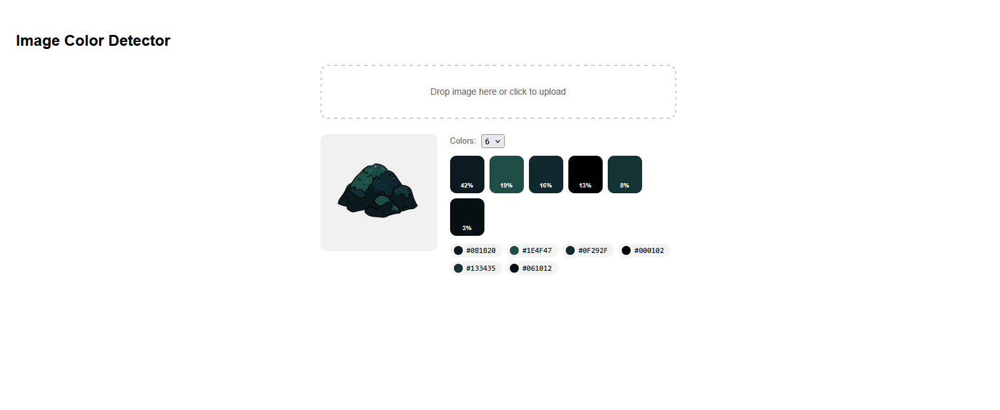

# color-detector

Drop any image and instantly extract its dominant colors. Built with React + k-means clustering — no external color libraries.

**Features:** drag & drop upload · adjustable color count · HEX codes with one-click copy · coverage percentages

